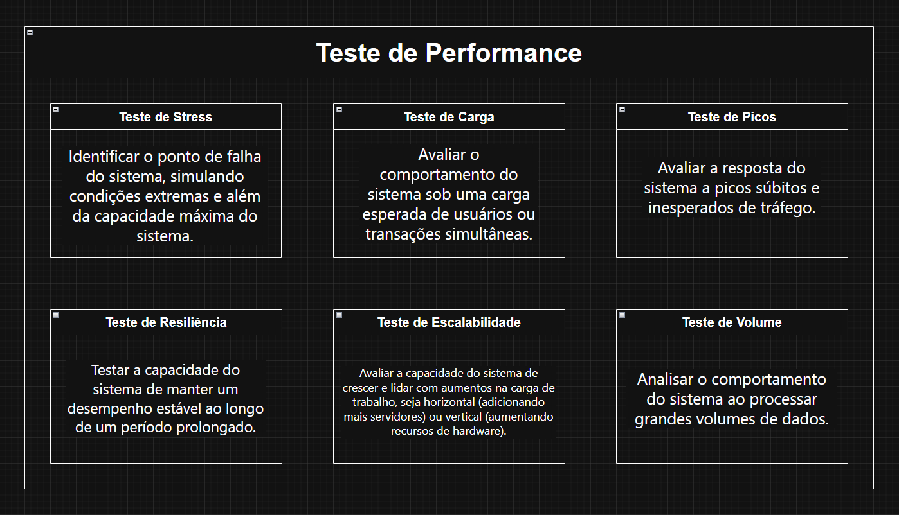

# Testes de Performance

Este projeto tem como objetivo fornecer uma compreensão aprofundada dos **testes de performance** e suas diversas abordagens, abordando os diferentes tipos de testes usados para avaliar o comportamento e a robustez de sistemas e aplicações sob diferentes condições de carga.

   

## Objetivo do Projeto

O principal objetivo deste projeto é apresentar e documentar os **testes de performance** mais comuns utilizados para garantir que sistemas e aplicações suportem o tráfego esperado e identifiquem falhas que podem ocorrer sob diferentes tipos de carga. O projeto cobre os seguintes tipos de testes:

**Testes de Carga (Load Testing)**: 
- Avaliar o comportamento do sistema sob uma carga esperada de usuários ou transações simultâneas.

**Testes de Stress (Stress Testing)**: 
- Identificar o ponto de falha do sistema, simulando condições extremas e além da capacidade máxima do sistema.

**Testes de Picos (Spike Testing)**: 
- Avaliar a resposta do sistema a picos súbitos e inesperados de tráfego.

**Testes de Resiliência (Endurance Testing)**: 
- Testar a capacidade do sistema de manter um desempenho estável ao longo de um período prolongado.

**Testes de Escalabilidade (Scalability Testing)**: 
- Avaliar a capacidade do sistema de crescer e lidar com aumentos na carga de trabalho, seja horizontal (adicionando mais servidores) ou vertical (aumentando recursos de hardware).

**Testes de Volume (Volume Testing)**: 
- Analisar o comportamento do sistema ao processar grandes volumes de dados.

## Estrutura do Projeto

Este projeto está estruturado em várias seções que cobrem os diferentes tipos de testes de performance, exemplos práticos e como configurar ferramentas de teste, como o **k6**, para realizar esses testes.

### Seções Principais

- **Introdução aos Testes de Performance**: Visão geral de como os testes de performance são conduzidos e sua importância para sistemas escaláveis.
- **Testes de Carga**: Como realizar testes de carga para verificar como o sistema se comporta sob uma carga esperada.
- **Testes de Stress**: Como identificar os limites de falha de um sistema, simulando cargas extremas.
- **Testes de Picos**: Avaliação da resposta do sistema a aumentos abruptos no tráfego.
- **Testes de Resiliência**: Como avaliar o desempenho do sistema em um longo período de tempo, simulando tráfego contínuo.
- **Testes de Escalabilidade**: Como testar o sistema para verificar se ele pode escalar de acordo com a necessidade.
- **Testes de Volume**: Como testar a capacidade do sistema para processar grandes quantidades de dados.

## Ferramentas Utilizadas

Neste projeto, utilizamos as seguintes ferramentas para realizar os testes de performance:

- **NGINX**: Um servidor web de código aberto, conhecido por sua alta performance, escalabilidade e baixo consumo de recursos.
- **K6**: Uma das ferramentas mais populares para realizar testes de carga e performance em sistemas. Ele permite simular grandes volumes de tráfego e gerar relatórios detalhados sobre a performance do sistema.

### Requisitos

- [**Visual Studio Code**](https://code.visualstudio.com/download): Para criar os testes
- [**NGINX**](./setup/nginx/0-nginx.md):Servidor WEB local
- [**VIM**](./setup/vim/vim.md): Para trabalhar com o NGINX
- [**k6**](./setup/k6/install.md): Para executar os testes

## Contribuições

Contribuições são bem-vindas! Se você deseja melhorar a documentação, corrigir um erro ou adicionar um novo tipo de teste, basta criar um **pull request**. Antes de começar a contribuir, por favor, leia nosso guia de **contribuição**.

Crie ou use umas das Branchs

- nginx
- testes
- chart

## Licença

Este projeto é licenciado sob a [MIT License](LICENSE).

---

## Tópicos para Leitura

- **[Documentação do k6](https://k6.io/docs/)**: Documentação oficial da ferramenta usada para realizar os testes.
- **[Introdução aos Testes de Performance](https://www.guru99.com/performance-testing.html)**: Um ótimo artigo que fornece uma visão geral sobre testes de performance.
- **[Testes de Carga com k6](https://k6.io/docs/using-k6/)**: Guia sobre como usar o k6 para realizar testes de carga.