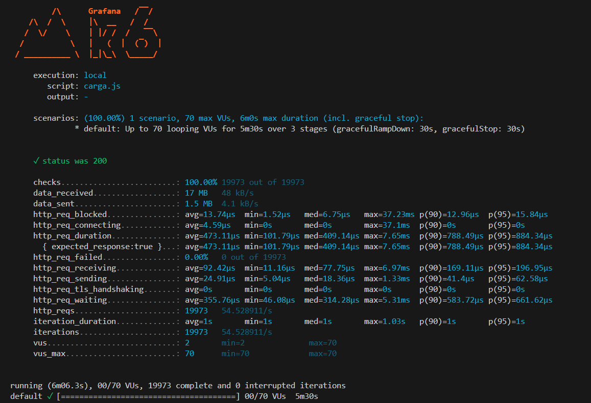

### 9. **Analisando os Resultados e Gerando Relatórios**
   - **Objetivo:** Interpretar os resultados dos testes e gerar relatórios úteis.
   - **Conteúdo:**
     - Como entender as principais métricas geradas pelo k6, como latência, throughput, e erro de taxa.
     - Como gerar relatórios em diferentes formatos (JSON, HTML, etc).
     - Usando ferramentas como Grafana para visualização de dados em tempo real.

   **Link para vídeo:** [Analisando Resultados do k6](#)

   <div align="center">
      
   </div>

   Este resultado descreve o desempenho de uma aplicação durante um teste de carga, provavelmente utilizando uma ferramenta de benchmark como o **k6**. 

## Aqui está um resumo e interpretação dos principais dados:

1. **Status HTTP (200)**:
   - Todos os pedidos HTTP retornaram um status 200, o que significa que a aplicação respondeu com sucesso a todas as solicitações. A taxa de sucesso foi de 100%.

2. **Checagens**:
   - **100% de checagens bem-sucedidas**, ou seja, todas as condições esperadas para cada requisição foram atendidas.

3. **Dados Transferidos**:
   - **Dados recebidos**: 17 MB, com uma média de 48 kB/s.
   - **Dados enviados**: 1.5 MB, com uma média de 4.1 kB/s.

4. **Tempo de Bloqueio de Requisição HTTP (http_req_blocked)**:
   - Em média, o tempo de bloqueio foi de **13.74 microssegundos (µs)**, com valores mínimos e máximos bem baixos, o que indica uma rede eficiente e sem atrasos significativos.

5. **Conexão HTTP (http_req_connecting)**:
   - O tempo médio de **conexão** foi de **4.59 µs**, com a maior parte das conexões sendo praticamente instantâneas (mediana de 0 µs).

6. **Duração da Requisição HTTP (http_req_duration)**:
   - O tempo médio de duração das requisições foi de **473.11 µs**.
   - O tempo mínimo foi de **101.79 µs**, enquanto o máximo foi **7.65 ms**, mostrando uma grande consistência no tempo de resposta da aplicação.

7. **Taxa de Falhas HTTP (http_req_failed)**:
   - **0% de falhas**, o que significa que todas as requisições foram bem-sucedidas.

8. **Recepção de Requisição (http_req_receiving)**:
   - O tempo médio para **receber** dados foi de **92.42 µs**, o que está bem abaixo do tempo total de uma requisição, indicando uma comunicação eficiente entre o cliente e o servidor.

9. **Envio de Requisição (http_req_sending)**:
   - O tempo médio de **envio** dos dados foi de **24.91 µs**, o que é muito rápido.

10. **Handshake TLS (http_req_tls_handshaking)**:
    - O tempo de handshake TLS foi **0**, indicando que a comunicação não usou criptografia ou o processo foi negligenciável.

11. **Tempo de Espera HTTP (http_req_waiting)**:
    - O tempo médio de espera (tempo entre o envio da requisição e o início da resposta) foi de **355.76 µs**.

12. **Requisições e Iterações**:
    - O total de requisições foi **19.973**, com uma taxa de aproximadamente **54,53 requisições por segundo**.
    - Cada iteração (ciclo completo de requisição-resposta) teve uma duração média de **1 segundo**, com variação mínima e máxima muito pequena (sempre cerca de 1 segundo).

13. **VUs (Virtual Users)**:
    - O teste usou entre **2 e 70 usuários virtuais** (VUs) durante o teste de carga, com o pico de 70 VUs simultâneos. Esse número é uma referência à quantidade de usuários simulados no sistema.

Esse resultado é um reflexo de uma aplicação de alta performance e sem erros durante o teste, mostrando baixa latência e alta consistência, além de ser capaz de lidar com uma quantidade considerável de requisições por segundo com um número variável de usuários simultâneos.

## HTML

Podemos fazer a importação do {htmlReport} e do {textSummary}, desse modo

```Javascript
import http from 'k6/http';
import { check, sleep } from 'k6';

import { htmlReport } from "https://raw.githubusercontent.com/benc-uk/k6-reporter/main/dist/bundle.js";
import { textSummary } from "https://jslib.k6.io/k6-summary/0.0.1/index.js";


export const options = {
  stages: [
    { duration: '60s', target: 70 },
    { duration: '4m', target: 70 },
    { duration: '30s', target: 0 },
  ],
};

export function handleSummary(data) {
  return {
    "summary.html": htmlReport(data),
    // Mostrar o resultado tanto na linha de comando quanto no summary.html
    stdout: textSummary(data, { indent: " ", enableColors: true }),
  };
}

export default function () {
  const res = http.get('http://localhost/');
  check(res, { 'status was 200': (r) => r.status == 200 });
  sleep(1);
}

```


## JSON

Para mostrar o resultado do k6 em formato JSON, você pode usar a opção de saída --out para especificar o formato desejado. Para gerar os resultados em JSON, você deve usar o seguinte comando:

```bash
k6 run --out json=resultados.json carga.js
```

Isso irá executar o seu script de teste (o seu_script.js) e gerar um arquivo resultados.json com as métricas do teste em formato JSON.